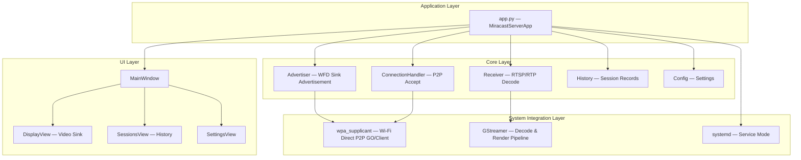
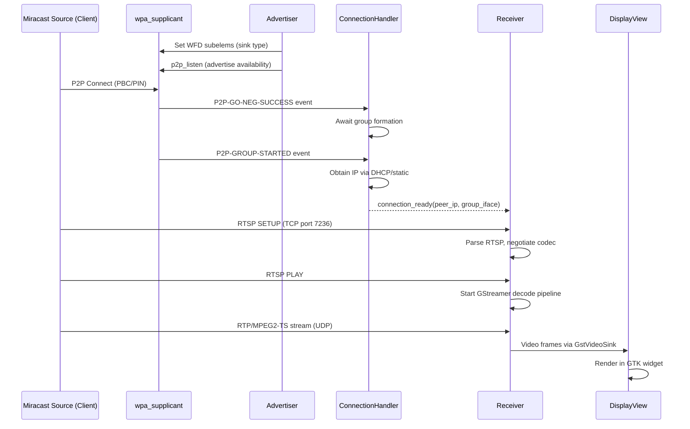
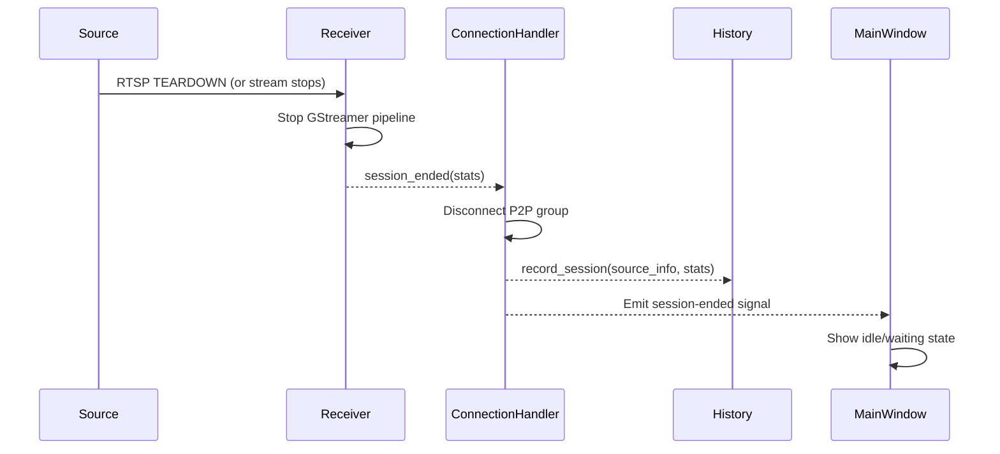

# Design Document: Ubuntu Miracast Server

## Overview

The Ubuntu Miracast Server is a Python 3.12 GTK 4 desktop application that receives incoming Miracast streams over Wi-Fi Direct and renders them in a display window. It is the companion receiver component to the existing ubuntu-miracast-client. The server advertises itself as a Miracast sink (WFD Primary Sink) via wpa_supplicant, accepts incoming P2P connections from Miracast sources, negotiates the RTSP/WFD session, receives the MPEG2-TS/RTP video stream, decodes it with GStreamer, and presents it in a GTK 4 window or fullscreen surface. It also supports headless service mode for digital signage scenarios where no local UI interaction is needed.

The application mirrors the modular architecture of the client — separating connection acceptance, stream receiving/decoding, session management, history, configuration, and UI into discrete modules with GObject signal-based communication between layers.

## Architecture




## Sequence Diagrams

### Main Flow: Incoming Miracast Connection



### Session Teardown




## Components and Interfaces

### Component 1: Advertiser (`advertiser.py`)

**Purpose**: Advertises the server as a Miracast/WFD sink device via wpa_supplicant, making it discoverable by Miracast sources.

**Interface**:
```python
class MiracastAdvertiser(GObject.Object):
    """Manages WFD sink advertisement via wpa_supplicant P2P."""

    # Signals
    __gsignals__ = {
        "advertising-started": (GObject.SignalFlags.RUN_FIRST, None, ()),
        "advertising-stopped": (GObject.SignalFlags.RUN_FIRST, None, ()),
        "advertising-error": (GObject.SignalFlags.RUN_FIRST, None, (str,)),
    }

    def __init__(self, device_name: str = "Ubuntu Miracast Server",
                 p2p_interface: str | None = None): ...
    def start_advertising(self) -> None: ...
    def stop_advertising(self) -> None: ...
    def is_advertising(self) -> bool: ...
    def set_device_name(self, name: str) -> None: ...
```

**Responsibilities**:
- Set WFD subelements to advertise as WFD_PRIMARY_SINK
- Configure RTSP control port in WFD subelements
- Run `p2p_listen` to make the device discoverable
- Handle interface auto-detection (same pattern as client's discovery)
- Manage advertising lifecycle

### Component 2: ConnectionHandler (`connection.py`)

**Purpose**: Accepts incoming Wi-Fi Direct P2P connections from Miracast sources, manages group formation and IP negotiation.

**Interface**:
```python
class IncomingConnection:
    """Represents an accepted P2P connection from a source."""
    peer_address: str        # MAC address of source
    peer_ip: str             # IP address of source
    peer_name: str           # Device name of source
    group_interface: str     # P2P group interface (e.g., p2p-wlo1-0)
    our_ip: str              # Our IP on the group interface
    connected_at: datetime   # Connection timestamp

class ConnectionHandler(GObject.Object):
    """Handles incoming P2P connections from Miracast sources."""

    __gsignals__ = {
        "connection-received": (GObject.SignalFlags.RUN_FIRST, None, (object,)),
        "connection-lost": (GObject.SignalFlags.RUN_FIRST, None, (str,)),
        "connection-error": (GObject.SignalFlags.RUN_FIRST, None, (str,)),
    }

    def __init__(self, p2p_interface: str | None = None): ...
    def start_listening(self) -> None: ...
    def stop_listening(self) -> None: ...
    def disconnect_peer(self, peer_address: str) -> None: ...
    def get_active_connection(self) -> IncomingConnection | None: ...
```

**Responsibilities**:
- Monitor wpa_supplicant events for incoming P2P connection requests
- Accept group owner negotiation (GO intent high to become GO)
- Handle DHCP server or IP assignment on group interface
- Emit connection-received when a source successfully connects
- Detect connection loss and emit connection-lost
- Support single active connection (one source at a time for v1)


### Component 3: Receiver (`receiver.py`)

**Purpose**: Manages the RTSP session negotiation and GStreamer decode/render pipeline. This is the core streaming component that receives, decodes, and presents the Miracast stream.

**Interface**:
```python
@dataclass
class ReceiverStats:
    """Statistics for a receiving session."""
    start_time: datetime
    end_time: datetime | None = None
    duration: int = 0              # seconds
    data_received: int = 0         # bytes
    average_bitrate: float = 0     # bps
    peak_bitrate: float = 0        # bps
    frames_decoded: int = 0
    frames_dropped: int = 0
    errors: int = 0
    resolution: tuple[int, int] = (0, 0)  # (width, height)
    codec: str = ""                # e.g., "H.264 Baseline"

class SourceInfo:
    """Information about the connected source device."""
    name: str
    address: str
    model: str
    resolution: tuple[int, int]
    codec: str

class MiracastReceiver(GObject.Object):
    """Receives and decodes incoming Miracast streams."""

    __gsignals__ = {
        "stream-started": (GObject.SignalFlags.RUN_FIRST, None, (object,)),
        "stream-stopped": (GObject.SignalFlags.RUN_FIRST, None, (object,)),
        "stream-error": (GObject.SignalFlags.RUN_FIRST, None, (str,)),
        "stats-updated": (GObject.SignalFlags.RUN_FIRST, None, (object,)),
        "resolution-changed": (GObject.SignalFlags.RUN_FIRST, None, (int, int)),
    }

    def __init__(self, video_widget: Gtk.Widget | None = None): ...
    def start_receiving(self, connection: IncomingConnection) -> bool: ...
    def stop_receiving(self) -> ReceiverStats: ...
    def is_receiving(self) -> bool: ...
    def get_stats(self) -> ReceiverStats | None: ...
    def set_video_widget(self, widget: Gtk.Widget) -> None: ...
```

**Responsibilities**:
- Run an RTSP server on the configured control port (default 7236)
- Handle RTSP OPTIONS, SETUP, PLAY, PAUSE, TEARDOWN from the source
- Parse WFD-specific RTSP parameters (video codecs, resolution, audio)
- Build GStreamer pipeline: `udpsrc → rtpmp2tdepay → tsdemux → h264parse → avdec_h264 → videoconvert → gtk4paintablesink`
- Emit stats every second (bitrate, frames, resolution)
- Support audio decoding when available (AAC → pulsesink)
- Detect stream loss and emit stream-error

### Component 4: History (`history.py`)

**Purpose**: Records completed receiving sessions for review. Follows the same pattern as the client's SessionHistory.

**Interface**:
```python
@dataclass
class ServerSessionRecord:
    """Record of a completed receiving session."""
    source_info: SourceInfo
    stats: ReceiverStats
    timestamp: datetime

    def to_dict(self) -> dict: ...

    @classmethod
    def from_dict(cls, data: dict) -> "ServerSessionRecord": ...

class ServerSessionHistory:
    """Manages persistence of server session records."""

    def __init__(self, history_path: str | None = None): ...
    def add_session(self, source_info: SourceInfo, stats: ReceiverStats) -> ServerSessionRecord: ...
    def get_sessions(self) -> list[ServerSessionRecord]: ...
    def clear(self) -> None: ...
```

**Responsibilities**:
- Persist sessions to `~/.local/share/ubuntu-miracast-server/history.json`
- Load existing history on startup
- Record source device info, duration, data received, resolution
- Provide interface for clearing history


### Component 5: Config (`config.py`)

**Purpose**: Manages application settings. Same pattern as client config but with server-specific defaults.

**Interface**:
```python
class ServerConfig:
    """Manages server configuration."""

    def __init__(self, config_path: str | None = None): ...
    def get(self, section: str, key: str, default: Any = None) -> Any: ...
    def set(self, section: str, key: str, value: Any) -> None: ...
    def save(self, config: dict | None = None) -> None: ...
```

**Default Configuration**:
```json
{
  "general": {
    "device_name": "Ubuntu Miracast Server",
    "start_minimized": false,
    "fullscreen_on_stream": true,
    "log_level": "INFO"
  },
  "streaming": {
    "rtsp_port": 7236,
    "audio_enabled": true,
    "max_resolution": "1920x1080",
    "preferred_codec": "H264"
  },
  "network": {
    "go_intent": 15,
    "connection_timeout": 30,
    "auto_accept": true
  },
  "service": {
    "enabled": false,
    "virtual_display": false,
    "idle_timeout": 0
  }
}
```

### Component 6: Service (`service.py`)

**Purpose**: Manages systemd user service for headless/digital signage mode. Same lifecycle management as the client's ServiceManager.

**Interface**:
```python
class ServerServiceManager:
    """Manages the systemd user service for headless operation."""

    SERVICE_NAME = "ubuntu-miracast-server"
    SERVICE_FILE = "ubuntu-miracast-server.service"

    def __init__(self): ...
    def is_service_enabled(self) -> bool: ...
    def is_service_running(self) -> bool: ...
    def enable_service(self) -> None: ...
    def disable_service(self) -> None: ...
    def start_service(self) -> None: ...
    def stop_service(self) -> None: ...

def run_as_service() -> int:
    """Run the server in headless service mode."""
    ...
```

**Responsibilities**:
- Generate and manage systemd user service file
- In service mode: start advertiser + connection handler without GTK UI
- Use a virtual display sink (fakesink or file output) in headless mode
- Support idle timeout configuration (auto-stop after inactivity)


## Data Models

### Model 1: IncomingConnection

```python
@dataclass
class IncomingConnection:
    """Represents a connected Miracast source."""
    peer_address: str        # P2P MAC address
    peer_ip: str             # IP address assigned during group formation
    peer_name: str           # Advertised device name
    group_interface: str     # P2P group interface name
    our_ip: str              # Our IP on the group interface
    connected_at: datetime   # When the connection was established
    go_role: bool = True     # Whether we are the Group Owner
```

**Validation Rules**:
- `peer_address` must be valid MAC format (XX:XX:XX:XX:XX:XX)
- `peer_ip` must be valid IPv4 address
- `group_interface` must be a non-empty string
- `connected_at` must not be in the future

### Model 2: ReceiverStats

```python
@dataclass
class ReceiverStats:
    """Statistics for a receiving session."""
    start_time: datetime = field(default_factory=datetime.now)
    end_time: datetime | None = None
    duration: int = 0
    data_received: int = 0
    average_bitrate: float = 0
    peak_bitrate: float = 0
    frames_decoded: int = 0
    frames_dropped: int = 0
    errors: int = 0
    resolution: tuple[int, int] = (0, 0)
    codec: str = ""
```

**Validation Rules**:
- `duration` is non-negative integer
- `data_received` is non-negative integer
- `frames_decoded` >= `frames_dropped`
- `resolution` values are non-negative

### Model 3: SourceInfo

```python
@dataclass
class SourceInfo:
    """Information about a Miracast source device."""
    name: str              # Device name from WFD
    address: str           # P2P MAC address
    model: str             # Device model string
    resolution: tuple[int, int] = (0, 0)
    codec: str = ""
    audio_codec: str = ""  # e.g., "AAC-LC" or ""
```

### Model 4: ServerSessionRecord

```python
@dataclass
class ServerSessionRecord:
    """Complete record of a receiving session."""
    source_info: SourceInfo
    stats: ReceiverStats
    timestamp: datetime = field(default_factory=datetime.now)

    def to_dict(self) -> dict:
        """Serialize to JSON-compatible dict."""
        return {
            "source_info": {
                "name": self.source_info.name,
                "address": self.source_info.address,
                "model": self.source_info.model,
                "resolution": list(self.source_info.resolution),
                "codec": self.source_info.codec,
                "audio_codec": self.source_info.audio_codec,
            },
            "stats": {
                "start_time": self.stats.start_time.isoformat(),
                "end_time": self.stats.end_time.isoformat() if self.stats.end_time else None,
                "duration": self.stats.duration,
                "data_received": self.stats.data_received,
                "average_bitrate": self.stats.average_bitrate,
                "peak_bitrate": self.stats.peak_bitrate,
                "frames_decoded": self.stats.frames_decoded,
                "frames_dropped": self.stats.frames_dropped,
                "errors": self.stats.errors,
                "resolution": list(self.stats.resolution),
                "codec": self.stats.codec,
            },
            "timestamp": self.timestamp.isoformat(),
        }

    @classmethod
    def from_dict(cls, data: dict) -> "ServerSessionRecord":
        """Deserialize from dict."""
        ...
```


## Algorithmic Pseudocode

### Algorithm 1: WFD Sink Advertisement

```python
def start_advertising(self) -> None:
    """
    ALGORITHM: Start WFD Sink Advertisement
    
    Preconditions:
      - wpa_supplicant is running with P2P support
      - P2P interface exists and is accessible
      - Not currently advertising
    
    Postconditions:
      - Device is discoverable as WFD Primary Sink
      - advertising-started signal emitted
      - _running is True
    """
    if self._running:
        return

    # Step 1: Find or verify P2P interface
    if not self._p2p_interface:
        self._p2p_interface, _ = _find_p2p_interface()
        if not self._p2p_interface:
            self.emit("advertising-error", "No P2P interface found")
            return

    # Step 2: Enable Wi-Fi Display on the interface
    _run_wpa_cli(self._p2p_interface, "set", "wifi_display", "1")

    # Step 3: Set WFD subelements advertising as PRIMARY SINK
    # Device Info bits: type=01 (primary sink), session_available=1, WSD=1
    # Format: SubelemID(2) + Length(4) + DeviceInfo(4) + ControlPort(4) + MaxThroughput(4)
    # DeviceInfo: 0x0111 = Primary Sink + Available + WSD supported
    rtsp_port_hex = format(self._rtsp_port, "04X")
    wfd_subelems = f"000600111{rtsp_port_hex}0032"
    _run_wpa_cli(self._p2p_interface, "wfd_subelem_set", "0", wfd_subelems)

    # Step 4: Set device name
    _run_wpa_cli(self._p2p_interface, "set", "device_name", self._device_name)

    # Step 5: Start P2P listen mode (makes us discoverable)
    result = _run_wpa_cli(self._p2p_interface, "p2p_listen")
    if "OK" not in result:
        self.emit("advertising-error", f"p2p_listen failed: {result}")
        return

    self._running = True
    self.emit("advertising-started")
```

### Algorithm 2: Connection Acceptance (Event Monitor)

```python
def _event_monitor_thread(self) -> None:
    """
    ALGORITHM: Monitor wpa_supplicant events for incoming connections
    
    Preconditions:
      - P2P interface is in listen mode
      - _running is True
    
    Postconditions:
      - On P2P-GO-NEG-REQUEST: auto-accept or emit for user confirmation
      - On P2P-GROUP-STARTED: extract group info, obtain IPs
      - On P2P-GROUP-REMOVED: emit connection-lost
    
    Loop Invariant:
      - wpa_cli process is alive while _running is True
      - All UI updates are dispatched via GLib.idle_add
    """
    # Start wpa_cli in event-listening mode
    process = subprocess.Popen(
        ["sudo", "wpa_cli", "-i", self._p2p_interface, "-a", "/dev/stdin"],
        stdin=subprocess.PIPE,
        stdout=subprocess.PIPE,
        stderr=subprocess.PIPE,
        text=True,
    )

    while self._running:
        line = process.stdout.readline()
        if not line:
            break

        line = line.strip()

        if "P2P-GO-NEG-REQUEST" in line:
            # Incoming connection request from a source
            peer_addr = self._extract_peer_address(line)
            if self._auto_accept:
                # Accept with high GO intent (we want to be Group Owner)
                _run_wpa_cli(
                    self._p2p_interface, "p2p_connect",
                    peer_addr, "pbc", f"go_intent={self._go_intent}"
                )
            else:
                GLib.idle_add(self._prompt_user_acceptance, peer_addr)

        elif "P2P-GROUP-STARTED" in line:
            # Group formed — we are now connected
            group_info = self._parse_group_started(line)
            connection = self._finalize_connection(group_info)
            if connection:
                GLib.idle_add(self.emit, "connection-received", connection)

        elif "P2P-GROUP-REMOVED" in line:
            # Connection lost
            GLib.idle_add(self.emit, "connection-lost", "P2P group removed")

    process.terminate()
```

### Algorithm 3: GStreamer Receive Pipeline Construction

```python
def _build_receive_pipeline(self, connection: IncomingConnection) -> str:
    """
    ALGORITHM: Construct GStreamer pipeline for receiving Miracast stream
    
    Preconditions:
      - connection is established with valid peer_ip
      - RTSP negotiation has determined codec and transport
      - video_widget is set (GUI mode) or None (service mode)
    
    Postconditions:
      - Returns a valid GStreamer pipeline description string
      - Pipeline handles both video and optional audio
    
    Input: connection (IncomingConnection), negotiated params
    Output: GStreamer pipeline string
    """
    rtp_port = self._negotiated_rtp_port  # from RTSP SETUP
    
    # Video decode pipeline
    video_pipeline = (
        f"udpsrc port={rtp_port} caps=\"application/x-rtp\""
        f" ! rtpmp2tdepay"
        f" ! tsdemux name=demux"
        f" demux.video_0"
        f" ! queue max-size-buffers=0 max-size-time=0 max-size-bytes=0"
        f" ! h264parse"
        f" ! avdec_h264"
        f" ! videoconvert"
    )

    # Video sink depends on mode
    if self._video_widget:
        # GUI mode: render to GTK4 paintable sink
        video_pipeline += " ! gtk4paintablesink name=videosink"
    else:
        # Headless/service mode: fakesink or file
        video_pipeline += " ! fakesink sync=true"

    # Audio decode pipeline (if negotiated)
    if self._audio_enabled and self._has_audio:
        audio_pipeline = (
            " demux.audio_0"
            " ! queue"
            " ! aacparse"
            " ! avdec_aac"
            " ! audioconvert"
            " ! pulsesink"
        )
        video_pipeline += audio_pipeline

    return video_pipeline
```


### Algorithm 4: RTSP Session Handler

```python
def _handle_rtsp_session(self, connection: IncomingConnection) -> None:
    """
    ALGORITHM: Handle WFD RTSP session negotiation with Miracast source
    
    Preconditions:
      - P2P connection is established
      - RTSP server socket is bound to configured port
      - Source will initiate RTSP communication
    
    Postconditions:
      - Video/audio codec parameters negotiated
      - RTP transport port assigned
      - GStreamer pipeline started on PLAY command
      - Session ended cleanly on TEARDOWN
    
    Loop Invariant:
      - RTSP socket remains open while session is active
      - All received RTSP messages are valid (or rejected with error response)
    """
    server_socket = socket.socket(socket.AF_INET, socket.SOCK_STREAM)
    server_socket.setsockopt(socket.SOL_SOCKET, socket.SO_REUSEADDR, 1)
    server_socket.bind((connection.our_ip, self._rtsp_port))
    server_socket.listen(1)
    server_socket.settimeout(self._connection_timeout)

    try:
        client_sock, client_addr = server_socket.accept()
        self._rtsp_socket = client_sock
    except socket.timeout:
        self.emit("stream-error", "RTSP connection timeout — source did not connect")
        return

    # RTSP message loop
    while self._running:
        request = self._read_rtsp_request(client_sock)
        if not request:
            break

        method = request.method

        if method == "OPTIONS":
            response = self._handle_options(request)
        elif method == "GET_PARAMETER":
            # WFD capability exchange
            response = self._handle_get_parameter(request)
        elif method == "SET_PARAMETER":
            # WFD session parameters (resolution, codec, transport)
            response = self._handle_set_parameter(request)
            self._apply_wfd_parameters(request.body)
        elif method == "SETUP":
            # Allocate RTP port, prepare pipeline
            response = self._handle_setup(request)
        elif method == "PLAY":
            # Start the GStreamer receive pipeline
            response = self._handle_play(request)
            self._start_pipeline(connection)
            GLib.idle_add(self.emit, "stream-started", self._source_info)
        elif method == "TEARDOWN":
            response = self._handle_teardown(request)
            client_sock.sendall(response.encode())
            break
        else:
            response = self._make_response(405, "Method Not Allowed")

        client_sock.sendall(response.encode())

    # Cleanup
    self._stop_pipeline()
    client_sock.close()
    server_socket.close()
```

### Algorithm 5: Stream Statistics Collection

```python
def _stats_monitor_thread(self) -> None:
    """
    ALGORITHM: Collect and emit streaming statistics every second
    
    Preconditions:
      - GStreamer pipeline is running
      - _stats is initialized with start_time
    
    Postconditions:
      - stats-updated emitted every ~1 second with current ReceiverStats
      - Stats reflect actual pipeline state where possible
    
    Loop Invariant:
      - _stats.duration monotonically increases
      - _stats.data_received monotonically increases
    """
    while self._running and self._pipeline_active:
        time.sleep(1.0)

        elapsed = (datetime.now() - self._stats.start_time).total_seconds()
        self._stats.duration = int(elapsed)

        # Query GStreamer pipeline for actual stats
        if self._pipeline:
            # Get bytes received from udpsrc
            udpsrc = self._pipeline.get_by_name("udpsrc0")
            if udpsrc:
                # GStreamer provides bytes-served property on some elements
                pass  # Use bus messages or pad probes for accurate counts

            # Get video info from decoder
            videosink = self._pipeline.get_by_name("videosink")
            if videosink:
                # Query current caps for resolution
                pad = videosink.get_static_pad("sink")
                caps = pad.get_current_caps()
                if caps:
                    struct = caps.get_structure(0)
                    w = struct.get_int("width")[1]
                    h = struct.get_int("height")[1]
                    self._stats.resolution = (w, h)

        # Estimate data from elapsed time and detected bitrate
        if self._detected_bitrate > 0:
            self._stats.data_received = int(
                (self._detected_bitrate / 8) * elapsed
            )
            self._stats.average_bitrate = self._detected_bitrate

        GLib.idle_add(self.emit, "stats-updated", self._stats)
```


## Key Functions with Formal Specifications

### Function 1: MiracastAdvertiser.start_advertising()

```python
def start_advertising(self) -> None
```

**Preconditions:**
- `self._running` is False (not already advertising)
- wpa_supplicant process is running on the system
- P2P-capable Wi-Fi interface exists

**Postconditions:**
- WFD subelements set to Primary Sink type
- Device is in P2P Listen mode (discoverable)
- `self._running` is True
- `advertising-started` signal emitted on success
- On failure: `advertising-error` signal emitted, `self._running` remains False

**Loop Invariants:** N/A

### Function 2: ConnectionHandler.start_listening()

```python
def start_listening(self) -> None
```

**Preconditions:**
- Advertiser is running (device is discoverable)
- No active connection exists (single-connection mode)
- P2P interface is valid

**Postconditions:**
- Background thread monitoring wpa_supplicant events is running
- Incoming P2P connection requests will be detected and handled
- `self._listening` is True

**Loop Invariants:**
- wpa_cli event process remains alive while `_running` is True
- At most one active connection at any time

### Function 3: MiracastReceiver.start_receiving()

```python
def start_receiving(self, connection: IncomingConnection) -> bool
```

**Preconditions:**
- `connection` is not None and has valid peer_ip, our_ip, group_interface
- Not currently receiving (`self._receiving` is False)
- RTSP port is available for binding

**Postconditions:**
- RTSP server socket bound and listening
- Background thread started for RTSP session handling
- Returns True if RTSP server started successfully
- On RTSP PLAY from source: GStreamer pipeline starts, `stream-started` emitted
- On failure: `stream-error` emitted, resources cleaned up

**Loop Invariants:**
- RTSP socket remains open throughout the session
- GStreamer pipeline state is PLAYING while stream is active
- Stats are emitted every ~1 second while pipeline is active

### Function 4: MiracastReceiver.stop_receiving()

```python
def stop_receiving(self) -> ReceiverStats
```

**Preconditions:**
- `self._receiving` is True (session is active)

**Postconditions:**
- GStreamer pipeline stopped and freed
- RTSP socket closed
- Background threads joined
- `self._receiving` is False
- `stream-stopped` signal emitted with final ReceiverStats
- Returns complete ReceiverStats with end_time set

**Loop Invariants:** N/A

### Function 5: ServerSessionHistory.add_session()

```python
def add_session(self, source_info: SourceInfo, stats: ReceiverStats) -> ServerSessionRecord
```

**Preconditions:**
- `source_info` is not None
- `stats` is not None and has valid start_time
- History file path is writable

**Postconditions:**
- New ServerSessionRecord created with current timestamp
- Record appended to in-memory session list
- History persisted to disk (JSON file updated)
- Returns the created ServerSessionRecord

**Loop Invariants:** N/A


## Example Usage

```python
# Example 1: Running the server application (GUI mode)
import sys
from miracast_server.app import main

sys.exit(main())


# Example 2: Programmatic usage of core components
from miracast_server.advertiser import MiracastAdvertiser
from miracast_server.connection import ConnectionHandler
from miracast_server.receiver import MiracastReceiver
from miracast_server.history import ServerSessionHistory

# Initialize components
advertiser = MiracastAdvertiser(device_name="Living Room Display")
connection_handler = ConnectionHandler()
receiver = MiracastReceiver()
history = ServerSessionHistory()

# Wire up signals
def on_connection_received(handler, connection):
    """Start receiving when a source connects."""
    print(f"Source connected: {connection.peer_name} ({connection.peer_ip})")
    receiver.start_receiving(connection)

def on_stream_started(recv, source_info):
    print(f"Receiving stream from {source_info.name} at {source_info.resolution}")

def on_stream_stopped(recv, stats):
    print(f"Session ended: {stats.duration}s, {stats.data_received} bytes")
    source_info = recv.get_source_info()
    history.add_session(source_info, stats)

connection_handler.connect("connection-received", on_connection_received)
receiver.connect("stream-started", on_stream_started)
receiver.connect("stream-stopped", on_stream_stopped)

# Start advertising and listening
advertiser.start_advertising()
connection_handler.start_listening()


# Example 3: Service mode (headless)
from miracast_server.service import run_as_service

# Runs GLib main loop with advertiser + connection handler
# No GTK window — uses fakesink for video
exit_code = run_as_service()


# Example 4: CLI entry point
# ubuntu-miracast-server                → GUI mode
# ubuntu-miracast-server --service      → Headless service mode
# ubuntu-miracast-server --name "TV"    → Custom device name
```

## Correctness Properties

*A property is a characteristic or behavior that should hold true across all valid executions of a system — essentially, a formal statement about what the system should do. Properties serve as the bridge between human-readable specifications and machine-verifiable correctness guarantees.*

### Property 1: WFD Subelement Generation

*For any* valid RTSP port number (1024–65535), the generated WFD subelement string shall correctly encode the port in hexadecimal at the expected byte offset, set the device type bits to WFD Primary Sink, and set session availability to available.

**Validates: Requirements 1.1, 1.2**

### Property 2: Advertising Idempotence

*For any* state where the Advertiser is already advertising, calling `start_advertising()` again shall not change the advertising state, emit additional signals, or issue additional wpa_cli commands. The operation is idempotent: `f(x) == f(f(x))`.

**Validates: Requirement 1.10**

### Property 3: P2P Event Parsing

*For any* valid P2P-GROUP-STARTED event string (varying group interface name, peer MAC address, peer IP, role, and device name), the ConnectionHandler shall correctly extract all fields into an IncomingConnection object with matching values and a connected_at timestamp within 1 second of the current time.

**Validates: Requirements 2.3, 2.4**

### Property 4: Single Active Session Invariant

*For any* sequence of connection and streaming operations, at most one stream is being received at any time. While the Receiver is in the receiving state, get_active_connection() must return a non-None IncomingConnection, and any additional P2P-GO-NEG-REQUEST events must be ignored without invoking p2p_connect or emitting signals.

**Validates: Requirements 2.6, 16.1, 16.2**

### Property 5: RTSP CSeq Echo

*For any* valid RTSP request with any CSeq integer value (0–2^31-1), the Receiver's response shall include a CSeq header with the exact same integer value as the request.

**Validates: Requirements 3.2, 3.11**

### Property 6: RTSP Malformed Request Rejection

*For any* byte string that is not a valid RTSP request (unparseable method, missing CSeq header, invalid content length, or exceeding 8192 bytes header size or 65536 bytes body size), the Receiver shall respond with an appropriate RTSP error code (400, 413) without crashing or entering an inconsistent state.

**Validates: Requirements 3.8, 10.3, 10.7**

### Property 7: WFD Parameter Parsing

*For any* valid WFD SET_PARAMETER body containing video codec specification, resolution (width and height within supported range), and RTP transport port, the Receiver shall correctly parse all fields into the internal negotiation structure without data loss, producing values equal to the input parameters.

**Validates: Requirement 3.4**

### Property 8: GStreamer Pipeline Construction Safety

*For any* valid combination of RTP port number (1024–65535) and codec name from the supported whitelist ("H264" for video, "AAC" for audio), the generated GStreamer pipeline string shall contain all required elements (udpsrc with correct port, rtpmp2tdepay, tsdemux, h264parse, decoder, videoconvert, sink) and shall not contain any string content not derived from validated parameters.

**Validates: Requirements 4.1, 10.4**

### Property 9: Session Record Serialization Round-Trip

*For any* valid ServerSessionRecord object (with arbitrary source name, MAC address, model string, resolution tuple, codec string, audio_codec string, timestamps, and ReceiverStats values including duration, data_received, bitrate, frames_decoded, frames_dropped, errors), serializing via `to_dict()` then deserializing via `from_dict()` shall produce an object where every field (source_info, stats, timestamp) is equal to the corresponding field of the original object.

**Validates: Requirements 7.1, 7.2, 7.3**

### Property 10: Session Record Deserialization Error Handling

*For any* dictionary that is missing one or more required fields (source_info, stats, timestamp) or contains values that cannot be parsed (non-ISO-8601 timestamp strings, non-integer numeric fields, missing nested fields), calling `from_dict()` shall raise an exception without creating a partial ServerSessionRecord object.

**Validates: Requirement 7.4**

### Property 11: History Maximum Records Enforcement

*For any* history containing N records where N >= 500, adding a new session record shall result in exactly 500 records being retained, with the oldest record (by timestamp) discarded and the new record included.

**Validates: Requirement 6.3**

### Property 12: History Sort Order

*For any* collection of session records with distinct timestamps, the HistoryManager's get_sessions() method shall return them sorted by timestamp in strictly descending order (most recent first).

**Validates: Requirement 6.6**

### Property 13: Peak Bitrate is Maximum

*For any* sequence of bitrate samples observed during a session (each sample being the bitrate value at a stats-updated interval), the recorded peak_bitrate shall equal the maximum value in the sequence.

**Validates: Requirement 6.9**

### Property 14: Configuration Round-Trip

*For any* valid configuration key-value pair (section, key, value) where value passes validation rules, setting the value via the set method and then getting it shall return the same value. *For any* key not present in the configuration, getting it with a specified default shall return that default without modifying the persisted file.

**Validates: Requirements 8.3, 8.5**

### Property 15: Configuration Value Validation

*For any* rtsp_port value outside the range 1024–65535, *for any* go_intent value outside the range 0–15, and *for any* connection_timeout value outside the range 1–120, the ConfigManager shall reject the change and retain the previous value. *For any* value within the valid range, the ConfigManager shall accept and persist the change.

**Validates: Requirement 8.6**

### Property 16: wpa_cli Parameter Validation

*For any* string parameter intended for wpa_cli commands, the validation function shall accept the string if and only if every character is alphanumeric, a colon, a hyphen, or an underscore. Strings containing any other character shall be rejected.

**Validates: Requirement 10.6**

### Property 17: IncomingConnection Field Validation

*For any* string, the IncomingConnection model shall accept it as peer_address if and only if it matches the MAC format XX:XX:XX:XX:XX:XX where each X is a case-insensitive hexadecimal digit. *For any* string, it shall accept it as peer_ip if and only if it is a valid IPv4 address in dotted-decimal notation with each octet in range 0–255. *For any* string, it shall accept it as group_interface if and only if it is non-empty and at most 15 characters. Violations shall raise a ValueError indicating the field and reason.

**Validates: Requirements 13.1, 13.2, 13.3, 13.7**

### Property 18: ReceiverStats Invariants

*For any* ReceiverStats object construction, the following constraints shall hold: duration >= 0, data_received >= 0, frames_decoded >= frames_dropped >= 0. Construction with values violating these constraints shall raise a ValueError.

**Validates: Requirements 13.4, 13.5, 13.6, 13.7**


## Error Handling

### Error Scenario 1: No P2P Interface Available

**Condition**: wpa_supplicant is not running or no P2P-capable Wi-Fi interface exists
**Response**: Emit `advertising-error` with descriptive message; UI shows error state with instructions to enable Wi-Fi and ensure wpa_supplicant is running
**Recovery**: User fixes system configuration; clicking "Retry" re-attempts interface detection

### Error Scenario 2: Source Connection Timeout

**Condition**: P2P group formed but source does not initiate RTSP within `connection_timeout` seconds
**Response**: Close RTSP server socket, disconnect P2P group, emit `stream-error`
**Recovery**: Return to advertising/listening state automatically

### Error Scenario 3: Stream Interrupted

**Condition**: UDP stream stops arriving (no packets for 5 seconds) or GStreamer pipeline errors
**Response**: Stop GStreamer pipeline, emit `stream-error` with details, record partial session in history
**Recovery**: Return to advertising/listening state; source can reconnect

### Error Scenario 4: Invalid RTSP Negotiation

**Condition**: Source sends malformed RTSP or requests unsupported codec/resolution
**Response**: Send RTSP 406 Not Acceptable; log the issue; emit `stream-error`
**Recovery**: Connection remains open for retry; source may renegotiate

### Error Scenario 5: GStreamer Pipeline Failure

**Condition**: Missing decoder plugin, hardware decode error, or display output failure
**Response**: Emit `stream-error` with GStreamer error message; attempt fallback to software decode if hardware fails
**Recovery**: Clean up pipeline; return to listening state

### Error Scenario 6: Permission Denied (wpa_supplicant)

**Condition**: Application lacks permission to execute wpa_cli commands (sudo required)
**Response**: Emit `advertising-error` with permission instructions
**Recovery**: Application should be run with appropriate permissions or via polkit policy

## Testing Strategy

### Unit Testing Approach

- Test each component in isolation using pytest
- Mock wpa_supplicant subprocess calls with `unittest.mock.patch`
- Mock GStreamer pipeline creation and state transitions
- Test RTSP message parsing/generation with known valid and invalid inputs
- Test data model serialization/deserialization roundtrips
- Test config defaults and persistence
- Target: 85%+ line coverage

**Key Unit Tests**:
- `test_advertiser.py`: WFD subelement generation, start/stop lifecycle, interface detection
- `test_connection.py`: Event parsing, P2P group started parsing, IP extraction
- `test_receiver.py`: RTSP request parsing, pipeline string generation, stats calculation
- `test_history.py`: Session recording, JSON persistence, load on startup
- `test_config.py`: Default generation, get/set, save/load

### Property-Based Testing Approach

**Property Test Library**: hypothesis

```python
from hypothesis import given, strategies as st

# Property: RTSP message parsing roundtrip
@given(st.integers(min_value=100, max_value=599))
def test_rtsp_response_status_codes_valid(status_code):
    response = make_rtsp_response(status_code, "Test")
    parsed = parse_rtsp_response(response)
    assert parsed.status_code == status_code

# Property: ReceiverStats invariants
@given(
    duration=st.integers(min_value=0, max_value=86400),
    data=st.integers(min_value=0, max_value=10**12),
)
def test_stats_bitrate_calculation_consistent(duration, data):
    stats = ReceiverStats(duration=duration, data_received=data)
    if duration > 0:
        expected_bitrate = (data * 8) / duration
        assert abs(calculate_bitrate(stats) - expected_bitrate) < 0.01

# Property: Session history persistence roundtrip
@given(st.text(min_size=1, max_size=100))
def test_session_record_serialization_roundtrip(device_name):
    source = SourceInfo(name=device_name, address="AA:BB:CC:DD:EE:FF", model="Test")
    stats = ReceiverStats()
    record = ServerSessionRecord(source_info=source, stats=stats)
    restored = ServerSessionRecord.from_dict(record.to_dict())
    assert restored.source_info.name == device_name
```

### Integration Testing Approach

- Test full flow with mocked wpa_supplicant (using subprocess mock)
- Test GStreamer pipeline with test video sources (`videotestsrc`)
- Test RTSP negotiation between a test client and the receiver
- Test service mode startup/shutdown lifecycle
- Use Docker/dev container for consistent environment


## Performance Considerations

- **Decode Latency**: Target < 100ms end-to-end from RTP packet receipt to pixel display. Use `avdec_h264` with low-latency flags; avoid buffering in demuxer (`max-size-time=0`).
- **Hardware Acceleration**: Prefer `vaapidecodebin` or `nvh264dec` when available; fall back to `avdec_h264` software decode. Detection at pipeline construction time.
- **Memory Usage**: GStreamer queues configured with bounded sizes to prevent memory growth on slow decode. Limit to 30 frames in queue.
- **CPU Overhead**: Stats collection thread sleeps 1s between updates. RTSP handling is event-driven (no polling). wpa_cli event monitor uses blocking readline.
- **Network Buffer**: UDP receive buffer set to 2MB (`udpsrc buffer-size=2097152`) to handle burst traffic without packet loss.
- **Fullscreen Rendering**: When in fullscreen mode, use direct scanout path via GTK4's GPU rendering. Avoid unnecessary video scaling by matching output resolution.

## Security Considerations

- **Wi-Fi Direct Security**: All P2P connections use WPA2 (enforced by wpa_supplicant group formation). PBC (Push Button Configuration) or PIN-based authentication.
- **RTSP on Localhost Only**: RTSP server binds to the P2P group interface IP only (not 0.0.0.0), limiting exposure to the direct P2P link.
- **Input Validation**: All RTSP headers and WFD parameters are validated before processing. Malformed requests are rejected with appropriate error codes.
- **No Arbitrary Code Execution**: GStreamer pipeline strings are constructed from validated parameters only (port numbers, codec names from whitelist). No user-supplied strings are interpolated into pipeline descriptions.
- **File Permissions**: Config and history files created with 0600 permissions (user-only read/write).
- **Auto-Accept Security**: When `auto_accept` is False, user must explicitly approve each incoming connection via UI prompt. Recommended for shared environments.
- **Subprocess Safety**: All wpa_cli commands use list-based subprocess calls (no shell=True). Parameters are validated before use.

## Dependencies

### Runtime Dependencies

| Package | Version | Purpose |
|---------|---------|---------|
| PyGObject | >=3.42.0 | GTK 4 / GLib / GStreamer Python bindings |
| pycairo | >=1.20.0 | Cairo rendering support |
| GTK 4 | System | UI framework |
| libadwaita | System | GNOME design patterns |
| GStreamer 1.0 | System | Media decode and render |
| gst-plugins-base | System | Core elements (typefind, videoconvert) |
| gst-plugins-good | System | UDP source, RTP depayloaders, matroska |
| gst-plugins-bad | System | MPEG-TS demuxer, H.264 parser |
| gst-plugins-ugly | System | x264 (if re-encoding needed) |
| gstreamer-vaapi | System (optional) | Hardware-accelerated decode |
| gtk4-paintable-sink | System | GTK 4 video rendering sink |
| wpa_supplicant | System | Wi-Fi Direct P2P |
| dnsmasq | System (optional) | DHCP server for P2P GO mode |

### Development Dependencies

| Package | Version | Purpose |
|---------|---------|---------|
| pytest | >=7.0.0 | Test framework |
| pytest-cov | >=4.0.0 | Coverage reporting |
| hypothesis | >=6.0.0 | Property-based testing |
| black | >=23.0.0 | Code formatting (line-length=100) |
| isort | >=5.12.0 | Import sorting |
| flake8 | >=6.0.0 | Linting |
| mypy | >=1.0.0 | Type checking |

### Project Structure

```
ubuntu-miracast-server/
├── src/
│   └── miracast_server/
│       ├── __init__.py
│       ├── app.py              # Application entry point
│       ├── advertiser.py       # WFD sink advertisement
│       ├── connection.py       # P2P connection acceptance
│       ├── receiver.py         # RTSP + GStreamer receive
│       ├── history.py          # Session history persistence
│       ├── config.py           # Configuration management
│       ├── service.py          # Systemd service management
│       └── ui/
│           ├── __init__.py
│           ├── main_window.py  # Main application window
│           ├── display_view.py # Video display widget
│           ├── sessions_view.py# Session history view
│           └── settings_view.py# Settings view
├── tests/
│   ├── test_advertiser.py
│   ├── test_connection.py
│   ├── test_receiver.py
│   ├── test_history.py
│   ├── test_config.py
│   └── test_service.py
├── debian/
│   ├── control
│   ├── rules
│   └── ...
├── pyproject.toml
├── setup.cfg
├── setup.py
├── Makefile
├── README.md
└── CHANGELOG.md
```

## UI Architecture

### Window Structure

```
MainWindow (Adw.ApplicationWindow)
├── HeaderBar (Adw.HeaderBar)
│   ├── Title: "Miracast Server"
│   ├── StatusIndicator (advertising/connected/receiving)
│   └── MenuButton → Settings, About
├── Stack (Gtk.Stack) [slide-left-right transition]
│   ├── DisplayView (page: "display")     — Video output + overlay controls
│   ├── SessionsView (page: "sessions")   — History of received sessions
│   └── SettingsView (page: "settings")   — Configuration
└── BottomBar
    ├── StatusLabel (e.g., "Waiting for connections..." / "Receiving from iPhone")
    └── Navigation (Display | Sessions | Settings)
```

### DisplayView States

```
[Idle/Waiting] → connection-received → [Connected] → stream-started → [Receiving/Playing]
                                                                              |
                                                                        stream-stopped
                                                                              |
                                                                        [Idle/Waiting]
```

**Idle State**: Shows centered icon + "Waiting for Miracast source..." text + device name
**Connected State**: Shows "Source connected, waiting for stream..." with source name
**Receiving State**: Fullscreen video with floating overlay controls (pause, disconnect, fullscreen toggle)

### Concurrency Model

| Operation | Thread | Sync Mechanism |
|-----------|--------|---------------|
| UI rendering | Main (GTK) | — |
| WPA event monitoring | Daemon thread | `GLib.idle_add` for signals |
| RTSP session handling | Daemon thread | `GLib.idle_add` for signals |
| GStreamer pipeline | GStreamer threads | GstBus messages → main thread |
| Stats collection | Daemon thread | `GLib.idle_add` for stats-updated |
| Config/History I/O | Main thread | Synchronous file I/O |

**Key Invariant**: All GObject signal emissions and GTK widget updates happen on the main thread via `GLib.idle_add()` or GstBus watch.
